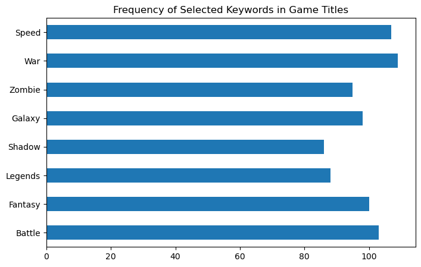

# Gaming Industry Trends Dataset

Project Update:

We initially set out to pull event and pricing data from the TicketMaster
API, but the public tier API didn't provide price-related info we needed. 

After receiving approval to pivot, we moved to an alternate dataset:  The Gaming Industry Trends Dataset on Kaggle:  [Kaggle](https://www.kaggle.com/datasets/haseebindata/gaming-industry-trends-1000-rows).

## Project Overview

This project explores trends in the video game industry - including revenue, 
platform, genre, developer and esports popularity - to understand what factors
are associated with a game's commercial success. 


## Dataset
- 1,000 rows, 11 columns 
- Only 50 unique game titles - some titles are re-released across multiple years,  
depending on demand
- Release years range from 2000 - 2024

Dependent Variable:  **Revenue (Millions $)**

Independent Variables: 


- Genre
- Platform
- Release Year
- Developer
- Players (Millions)
- Peak Concurrent Players
- Metacritic Score
- Esports Popularity

These variables can help explain possible differences in revenue between games.

### Are these variables quantitative or categorical?

The dataset has both types of variables.

- Categorical variables include genre, platform, developer, and esports popularity.
- Quantitative variables include release year, players, peak concurrent players, and Metacritic score.

### How many independent variables do you have?

There are more than 5 independent variables in this dataset. If revenue is the dependent variable, there are around 9 or 10 other columns that could be used as predictors depending on the analysis.

## Analysis Approach

- Univariate analysis
- Bivariate analysis - mean revenue grouped by genre and by developer
- Text/keyword analysis (`alina_eda.ipynb`)- word frequency counts across game titles to identify common naming patterns
- Initial TicketMaster API exploration (`api.ipynb`) - events API calls for NYC 
music events, used to validate the team's data ingestion setup before the pivot. 

## Results

Revenue by genre 
- RPG leads at $2,716.13M average revenue
- Sports trails at $2,284.36m average revenue
- Genres in between (Fighting, Simulation, Horror, Adventure, Racing, Strategy,
Shooter, Action) cluster fairly closely in the $2,300 - 2,650M range.  

Revenue by developer (mean, top 10):
- Capcom leads at $2,697.99M average revenue, followed closely by Sony, Nintendo,
Activision, and EA
- Ubisoft is lowest among the top 10 developers at $2,264.02M

Title keyword frequency: "War" (109), "Speed" (107), "Battle" (103), "Fantasy" (100) and "Galaxy" (98) are the most common words across game titles suggesting themes like action/conflict and sci-fi dominate naming conventions of games. 


## Individual Contribution 

## Team Members & Roles

1. Alina Tsui - Technical Lead
2. Oussama Fathi - Team Lead
3. Ye Morris - Data Analyst
4. Lofinda Beynis - Data Analyst
5. Shaina Smith - Data Analyst
6. Khadija Bangura- Coordinator/Analyst


### Is this variable categorical or quantitative?

This variable is quantitative since it is made up of numeric values. Because of that, it could be used for regression or for looking at patterns in revenue.


## Repository Structure
```
├── README.md
├── api.ipynb (Start here - API calls and pandas dataframe)
├── data
│   ├── processed
│   │   ├── TicketMaster.csv
│   │   └── gaming_industry_trends.csv
│   └── raw
├── notebooks
│   ├── alina_eda.ipynb (Individual EDA - Alina)
│   ├── api.ipynb
│   ├── gaming_industry_trends.csv
│   ├── khadija_eda.ipynb
│   ├── lofinda_eda.ipynb
│   ├── oussama_eda.ipynb
│   ├── shaina_eda.ipynb
│   └── ye_eda.ipynb
├── output.txt
├── outputs
│   └── Frequency_selected_keywords.png
├── requirements.txt
└── src
    ├── data_ingestion.py
    ├── process_data.py
    └── utils.py

``` 

## Project Evidence 

Title Keyword Frequency




## Tech Stack

Python, pandas, requests, python-dotenv (for TicketMaster API key management)
